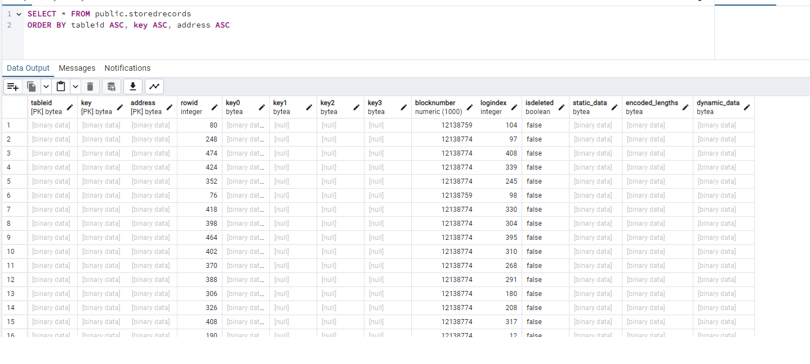

## MUD Tables Log Processing with Postgres

This module is responsible for processing the MUD tables log events from the chain and storing the data in a Postgres database.

### Installation

1. Prerequisites and first time setup

    1.1 Install Postgres and create a database.

    1.2 Install Dotnet net8.0 or higher

    1.3 At the command line next to the project file, run the following command to install the required packages and build

    ``` bash
    dotnet restore
    dotnet build
    ```

2. In appsettings.json, update the connection string to point to the database.
    ``` json
    "ConnectionStrings": {
        "PostgresConnection": "Host=localhost;Database=CafeCosmosSession1;Username=postgres;Password=password"
      }
    ```
  
3. Setup the database using migrations. Run the following commands in the terminal next the project file or executable using EF
    ``` bash
    dotnet ef migrations add InitialCreate
    dotnet ef database update 
    ```

4. Configure appsettings.json with the address of the world / land, rpc url, start block number, number of blocks to process per request

    ``` json
    "BlockchainSettings": {
        "Address": "0xBA24a3E1980D25E3A23A0d62dDA9a49917D811D6",
        "RpcUrl": "https://rpc.garnetchain.com",
        "StartAtBlockNumberIfNotProcessed": 12138750,
        "NumberOfBlocksToProcessPerRequest": 300
      }
    ```

5 ```dotnet run```

## Database table processed




## Reading the data from the database
See the example **VisionContracts.ReadingLocalPostgres.Console**
